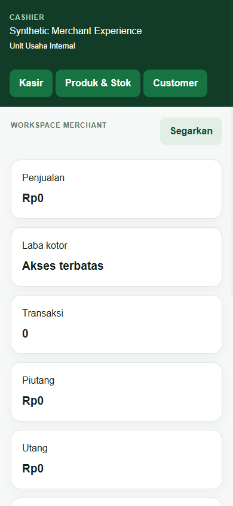

# Panduan Kasir & Supervisor — Suq Shogir

Terakhir diperbarui: 9 Oktober 2026

Menu selalu mengikuti izin efektif, bukan sekadar label jabatan. Cashier tidak melihat laporan laba/HPP/keuangan privat kecuali Owner secara eksplisit memberi izin yang tepat.

## Kasir

1. Aktivasi akun menggunakan kode dari Owner.
2. Masuk dan pilih usaha bila akun terhubung ke lebih dari satu merchant.
3. Buka shift pada terminal dan akun kas yang benar.
4. Tambahkan produk ke keranjang.
5. Pilih metode pembayaran:
   - Tunai: masukkan uang diterima; kembalian dihitung integer.
   - Bank/QRIS: wajib bukti/referensi sesuai flow.
   - Dompet Santri: online-authoritative, saldo dan kepemilikan diverifikasi server.
   - Kredit: hanya customer terdaftar yang memenuhi aturan kredit.
6. Tunggu hasil server sebelum menekan lagi.
7. Tutup shift dengan kas fisik aktual.

Jika status pembayaran Bank/QRIS masih pending, transaksi belum boleh dianggap lunas. Jangan memindahkan atau mengubah riwayat posted.

## Supervisor

Supervisor dapat menerima izin operasional tambahan, misalnya produk, stok, pembelian, supplier, AP/AR, laporan penjualan/stok/customer/online, dan pengelolaan order. Supervisor tidak otomatis mendapat:

- ledger privat Owner;
- modal atau prive;
- pengaturan pengguna/permission;
- laporan laba bila izin REPORT_PROFIT tidak diberikan.

## Koreksi dan retur

- Retur harus merujuk transaksi sumber.
- Alasan wajib diisi.
- Refund mengikuti komponen pembayaran asli.
- Retur stok mengembalikan HPP FIFO asli, bukan HPP saat ini.
- Retry dengan request yang sama tidak boleh menciptakan refund atau transaksi kedua.

## Saat koneksi bermasalah

- Jangan membuat transaksi baru dengan ID berbeda untuk penjualan yang sama.
- Biarkan aplikasi memeriksa request yang tersimpan.
- Jika status tetap tidak pasti, hentikan transaksi berikutnya dan hubungi Owner.
- Jangan menyatakan pembayaran berhasil hanya berdasarkan timeout atau layar lokal.
