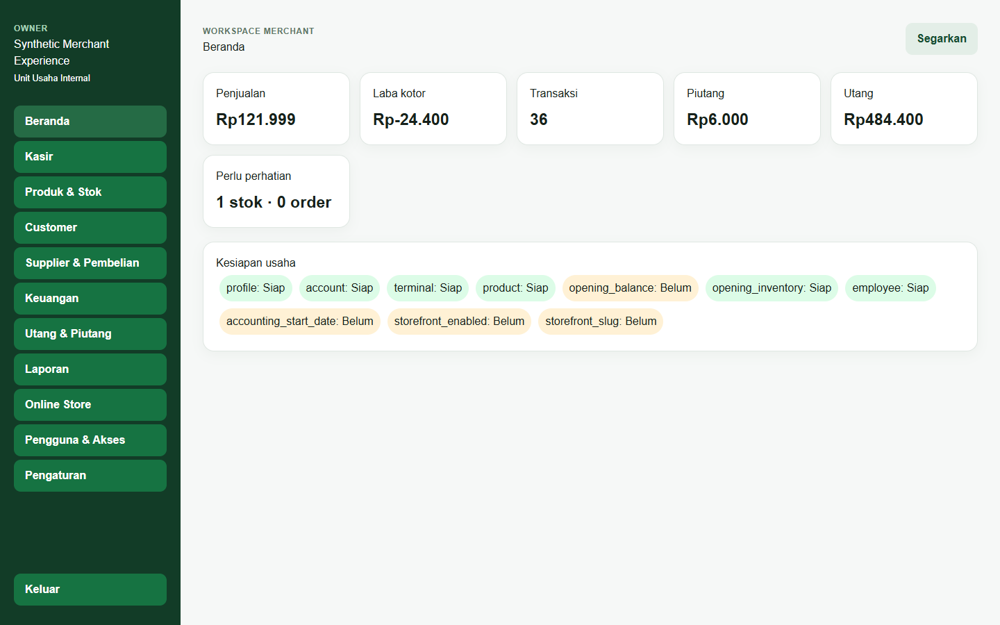
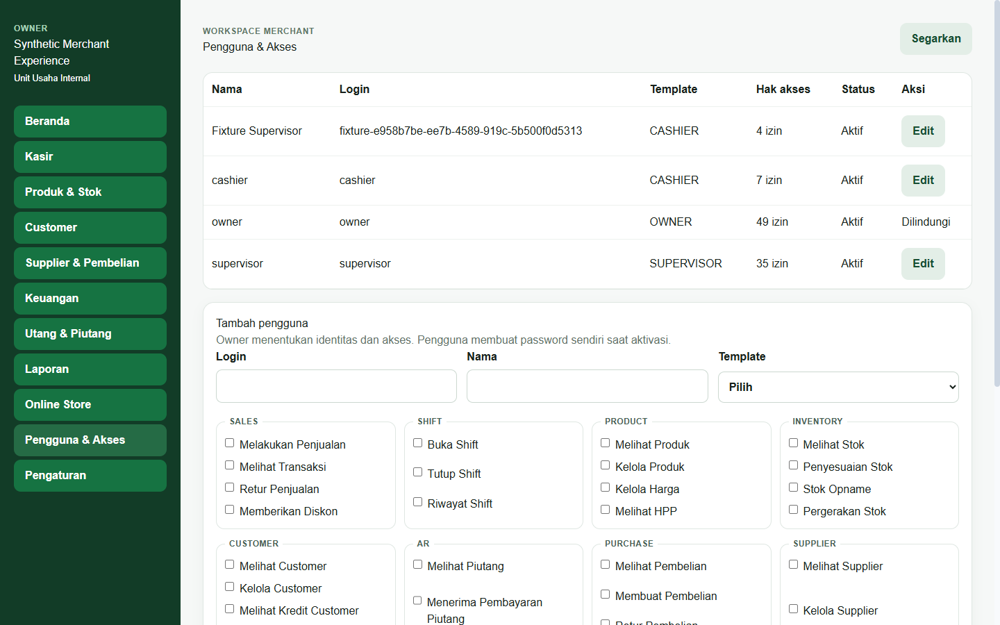
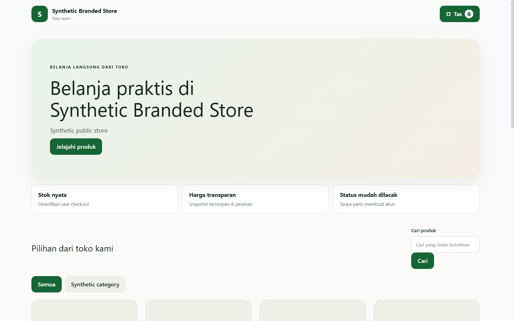
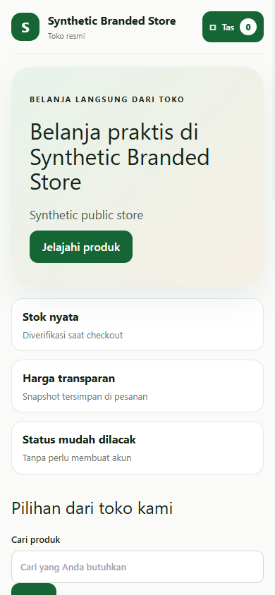

# Panduan Owner — Suq Shogir

Terakhir diperbarui: 9 Oktober 2026

Owner mengatur profil usaha, produk, stok, keuangan, toko online, dan akses tim. Semua nominal menggunakan Rupiah integer dan semua transaksi finansial melewati API canonical.

## Aktivasi pertama

1. Buka Suq Shogir.
2. Pilih **Aktivasi akun**.
3. Masukkan ID login dan kode aktivasi dari Admin tenant.
4. Buat password pribadi minimal 12 karakter dan ulangi.
5. Setelah aktivasi berhasil, masuk dengan ID login dan password baru.

Kode hanya berlaku sekali. Jangan membagikan password. Jika kode hilang atau kedaluwarsa, minta kode baru melalui pengelola yang berwenang.

## Checklist mulai operasional

Lengkapi secara bertahap:

1. **Profil usaha** — nama, alamat, kontak, branding, dan struk.
2. **Tanggal mulai pembukuan** — ditetapkan satu kali dan tidak ditimpa oleh penyimpanan profil berikutnya.
3. **Kas/rekening** — tambah akun Kas, Bank, atau QRIS yang benar-benar dipakai.
4. **Produk** — nama, SKU, harga jual, kategori, dan status.
5. **Stok awal** — masukkan jumlah dan HPP awal. Ini membuat movement FIFO, bukan pembelian dan bukan utang supplier.
6. **Saldo awal** — pilih jenis **Saldo awal**. Ini tidak dihitung sebagai pendapatan.
7. **Karyawan** — buat Kasir/Supervisor dengan izin minimum.
8. **Toko online** — atur publikasi, harga online, identitas toko, dan produk yang boleh tampil.

## Produk dan stok

- Produk baru tidak otomatis dipublikasikan online.
- POS dan ONLINE memakai produk serta stok canonical yang sama.
- Harga online dapat berbeda, tetapi server menyimpan snapshot harga pada order.
- Gunakan **Stok Awal** hanya saat migrasi awal. Setelah berjalan, gunakan Pembelian, Penyesuaian, atau Opname sesuai kejadian nyata.

## Keuangan

- **Saldo awal** bukan pendapatan.
- **Modal** bukan pendapatan operasional.
- **Prive** bukan biaya operasional.
- Wallet clearing bukan kas yang bebas digunakan merchant.
- Pembayaran supplier/customer harus merujuk sumber utang/piutang.
- Jangan mengulang klik jika request sedang diproses; idempotency melindungi retry, bukan pembukuan ganda yang disengaja.

## Pengguna & akses

1. Buka **Pengguna & Akses**.
2. Isi login, nama, dan template Kasir/Supervisor.
3. Centang hanya izin yang diperlukan.
4. Simpan.
5. Bagikan kode aktivasi sekali pakai secara aman.

Owner dilindungi dari penurunan akses melalui alur pengguna biasa. Perubahan izin berlaku dari server dan menu menyesuaikan izin efektif.

## Toko online

Storefront mendukung branding, pencarian, kategori, detail produk, tas, checkout, dan pelacakan order. Produk nonaktif, tidak dipublikasikan, atau stoknya tidak tersedia tidak dapat dibeli. Order lama mempertahankan snapshot item dan harga.

